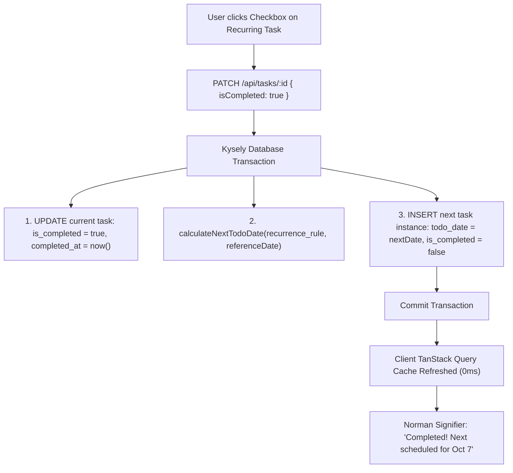

# Feature Specification: Repeating Tasks (Recurrence Engine)

## 1. Overview & Vision

In traditional task systems, repeating tasks either clog the database with pre-generated future clutter or rely on fragile background cron daemons. SMT implements a clean, event-driven **Next-Occurrence Materialization** model:

- **The Single-Active-Instance Law (Jason Fried):** A repeating task maintains exactly one active pending instance at any given time. When you complete today's occurrence, the completed task remains logged in history, and the system immediately schedules the _next_ occurrence for its upcoming civil execution day (`todo_date`).
- **No Background Daemons (John Carmack):** Recurrence is computed synchronously within the completion database transaction. Zero background cron daemons, zero polling overhead, zero CPU waste when idle.

---

## 2. Recurrence Frequencies & Rules

The system supports four distinct real-world rhythms:

| Frequency   | Identifier | Configurable Parameters                      | Example Real-World Use Case                                                                  |
| :---------- | :--------- | :------------------------------------------- | :------------------------------------------------------------------------------------------- |
| **Daily**   | `DAILY`    | `interval?: number` (default 1)              | Morning meditation, daily journaling.                                                        |
| **Weekly**  | `WEEKLY`   | `daysOfWeek: number[]` (0=Sun..6=Sat)        | Gym workouts on Monday, Wednesday, Friday (`[1, 3, 5]`).                                     |
| **Monthly** | `MONTHLY`  | `daysOfMonth: number[]` (1..31)              | Pay rent on the 1st (`[1]`), audit finances on the 15th & 30th (`[15, 30]`).                 |
| **Yearly**  | `YEARLY`   | `yearlyDate: { month: number, day: number }` | File annual taxes on April 15 (`{ month: 4, day: 15 }`), celebrate anniversary on October 4. |

---

## 3. Data Architecture & Relational Schema (PostgreSQL)

```sql
-- Migration 005: Add recurrence support to tasks
ALTER TABLE tasks
  ADD COLUMN recurrence_rule JSONB DEFAULT NULL,
  ADD COLUMN parent_task_id UUID REFERENCES tasks(id) ON DELETE SET NULL;

CREATE INDEX idx_tasks_parent_task_id ON tasks(parent_task_id);
```

### 3.1 Field Semantics

- `recurrence_rule`: A validated JSONB object storing the frequency and rule parameters.
- `parent_task_id`: Points to the original parent task template in the chain, enabling historical lineage tracking while allowing each completed occurrence to stand as an independent immutable record.

---

## 4. Pure Functional Date Calculation Engine (`calculateNextTodoDate`)

Next occurrence calculation is a pure deterministic function executed with zero side effects:

$$\text{calculateNextTodoDate}(\text{rule: RecurrenceRule}, \text{referenceDateStr: 'YYYY-MM-DD'}): \text{'YYYY-MM-DD'}$$

### 4.1 Edge Cases & Calendar Clamping (Anders Hejlsberg)

1. **End-of-Month Clamping:** If a task repeats on day 31, in months with 30 days (April, June, Sept, Nov) it clamps to day 30. In February, it clamps to day 28 (or 29 in leap years).
2. **Weekly Day Cycling:** If today is Wednesday and the rule is `[1, 3, 5]` (Mon, Wed, Fri), the next date is Friday. If today is Friday, the next date cycles forward to next Monday (+3 days).
3. **Reference Point:** Calculations always project forward from **today's civil reference date** (or simulated date), ensuring that overdue tasks never spawn an already-overdue subsequent occurrence.

---

## 5. Transactional Next-Occurrence Materialization (John Carmack)

When a user marks a task completed via `PATCH /api/tasks/:id`:



Both operations are committed atomically. If the insertion of the next occurrence fails, the completion rolls back.

---

## 6. UI/UX & Cognitive Ergonomics (Don Norman)

### 6.1 Progressive Disclosure in Creation & Edit Forms

- **Recurrence Toggle:** In the details drawer, a dropdown presents: `Does not repeat`, `Daily`, `Weekly`, `Monthly`, `Yearly`.
- Selecting a frequency progressively reveals only the relevant sub-controls:
  - **Weekly:** Seven circular weekday pills (`M`, `T`, `W`, `T`, `F`, `S`, `S`).
  - **Monthly:** Multi-select chips for days `1` through `31`.
  - **Yearly:** Month dropdown and day selector.

### 6.2 Recurrence Signifier on Task Cards

- Recurring tasks display a distinct **Repeat icon (`RotateCw`)** and a human-readable subtitle (e.g., _"Repeats Mon, Wed, Fri"_ or _"Repeats Monthly on 1st"_).
- The completion checkbox remains responsive and provides immediate feedback indicating when the task is next scheduled.
