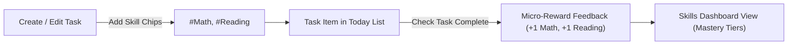

# Feature Specification: Skills & Capability Progression

## 1. Overview & Vision

In conventional task managers, tasks disappear upon completion, leaving the user with a feeling of running on a treadmill: you finish today's tasks only to face an identical list tomorrow.

The **Skills** feature transforms task completion from mere chore checklist into tangible capability building:

- **Core Question Answered:** _"Where is my daily effort going, and what real-world skills am I cultivating over time?"_
- **Example:** Completing the task _"Read Chapter 4 of Linear Algebra"_ develops both **`#Math`** and **`#Reading`**.
- **The Anti-Pattern (Jason Fried):** We strictly avoid bloated fantasy RPG mechanics (complex XP curves, mana bars, attribute multipliers, cooldowns, or character sheets). Productivity tools must not become video game chores. Skills represent transparent, real-world capability investment.

---

## 2. Core Concepts & Terminology

| Concept               | Term / Entity      | Data Model       | Description                                                                                                                                            |
| :-------------------- | :----------------- | :--------------- | :----------------------------------------------------------------------------------------------------------------------------------------------------- |
| **Skill**             | `skills`           | Entity Table     | A user-defined domain of competency (e.g. `Math`, `TypeScript`, `Writing`, `Fitness`, `Guitar`), identified by name and an accent color.               |
| **Task Association**  | `task_skills`      | Junction Table   | A many-to-many relationship linking tasks to skills. A single task can improve multiple skills; a skill aggregates multiple tasks.                     |
| **Mastery Progress**  | Derived Projection | Pure Aggregation | The number of completed tasks tagged with that skill. Calculated dynamically to eliminate database counter drift.                                      |
| **Progression Tiers** | UI Milestone       | Pure Function    | Transparent milestones representing depth of practice (e.g., Novice: 1–5 tasks, Practitioner: 6–20 tasks, Proficient: 21–50 tasks, Master: 50+ tasks). |

---

## 3. Relational Database Schema (PostgreSQL)

```sql
-- Skills Entity Table
CREATE TABLE skills (
  id UUID PRIMARY KEY DEFAULT gen_random_uuid(),
  user_id UUID NOT NULL REFERENCES users(id) ON DELETE CASCADE,
  name VARCHAR(100) NOT NULL,
  color VARCHAR(20) NOT NULL DEFAULT '#6366f1',
  created_at TIMESTAMPTZ NOT NULL DEFAULT now(),
  updated_at TIMESTAMPTZ NOT NULL DEFAULT now(),
  CONSTRAINT uq_skills_user_name UNIQUE (user_id, LOWER(name))
);

-- Many-to-Many Junction Table
CREATE TABLE task_skills (
  task_id UUID NOT NULL REFERENCES tasks(id) ON DELETE CASCADE,
  skill_id UUID NOT NULL REFERENCES skills(id) ON DELETE CASCADE,
  PRIMARY KEY (task_id, skill_id)
);

-- Indexing for instantaneous joins and lookups
CREATE INDEX idx_task_skills_skill_id ON task_skills(skill_id);
CREATE INDEX idx_task_skills_task_id ON task_skills(task_id);
```

### 3.1 Referential Integrity & Multi-Tenancy Rules

- **Multi-Tenant Ownership Verification:** When attaching `skillIds` to a task in `TasksService`, the server must verify that all provided skill IDs belong to the authenticated user's `user_id`.
- **Cascade Behavior:** Deleting a skill automatically removes its associations in `task_skills` without deleting or modifying the underlying tasks.

---

## 4. Derived Mastery Projection (Zero State Drift)

To prevent synchronization drift, skill progression is never stored as a mutable static counter on the `skills` table:

$$\text{Mastery Count} = \text{COUNT}(\text{completed tasks linked to skill})$$

If a user unchecks a task, deletes a task, or re-associates skills, the mastery count immediately reflects the exact truth without requiring manual reconciliation or background cron recalculations.

---

## 5. High-Performance Query Architecture (John Carmack)

To prevent N+1 query overhead when listing tasks with their associated skills, queries in Kysely utilize PostgreSQL's native `json_agg` aggregation:

```sql
SELECT
  tasks.*,
  COALESCE(
    json_agg(
      json_build_object('id', s.id, 'name', s.name, 'color', s.color)
    ) FILTER (WHERE s.id IS NOT NULL),
    '[]'
  ) AS skills
FROM tasks
LEFT JOIN task_skills ts ON ts.task_id = tasks.id
LEFT JOIN skills s ON s.id = ts.skill_id
WHERE tasks.user_id = $1
GROUP BY tasks.id
ORDER BY tasks.created_at DESC;
```

This retrieves the entire task list and all attached skills in a **single database query** with index scans, executing in <2ms.

---

## 6. UI/UX & Cognitive Ergonomics (Don Norman)



### 6.1 Affordances & Tagging

- **Skill Chip Selector:** In `TaskList` and `TaskEditForm`, users can tag tasks with skills using an intuitive multi-chip input.
- Typing filters existing skills; pressing `Enter` creates and assigns a new skill instantaneously.
- Skill tags appear on task items as distinct, subtle pastel badges (`#Math`, `#Reading`) that do not visually collide with temporal status badges (`Overdue`, `Upcoming`).

### 6.2 Micro-Reward Feedback Loop

- Completing a task with associated skills triggers immediate visual feedback: subtle floating indicator chips (`+1 Math`, `+1 Reading`) that gently rise and fade out.
- This creates immediate positive reinforcement, confirming that effort translated into tangible mastery.

### 6.3 Dedicated Skills View

- Accessible via the top navigation bar (`Today`, `Skills`, `Habits`, `Goals`).
- Displays a grid of user skills with:
  - Skill name and colored accent tag.
  - Total completed tasks contributing to the skill.
  - Recent activity timeline.
  - Transparent progression tier (Novice $\rightarrow$ Practitioner $\rightarrow$ Proficient $\rightarrow$ Master).

---

## 7. Contract & API Specifications (`@self/contracts`)

```typescript
export interface SkillDto {
  readonly id: string;
  readonly name: string;
  readonly color: string;
  readonly completedTaskCount: number;
  readonly createdAt: string;
  readonly updatedAt: string;
}

export const CreateSkillSchema = z.object({
  name: z.string().trim().min(1).max(100),
  color: z
    .string()
    .regex(/^#[0-9a-fA-F]{6}$/, 'Must be valid hex color')
    .optional(),
});

export const UpdateSkillSchema = z.object({
  name: z.string().trim().min(1).max(100).optional(),
  color: z
    .string()
    .regex(/^#[0-9a-fA-F]{6}$/)
    .optional(),
});

// CreateTaskDto & UpdateTaskDto extension:
// skillIds: z.array(z.string().uuid()).optional()
```

### Planned API Endpoints

- `GET /api/skills`: Lists all skills for the current user with dynamic completed task counts.
- `POST /api/skills`: Creates a new skill.
- `PATCH /api/skills/:id`: Updates skill name or color.
- `DELETE /api/skills/:id`: Deletes a skill and removes task associations.
